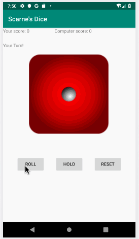

# Applied CS Skills - *Scarne's Dice*

**Scarne's Dice** is an android app that a turn-based dice game, so we will require a way to roll the die (and show the result), end the player turn and to reset the game..

Submitted by: **Ali Zhao**

Time spent: **5** hours spent in total

## User Stories

The following **required** functionality is completed:

* [X] Implemented the UI
* [X] Implemented the game
* [X] Game logic
* [X] Computer turn

The following **additional** features are implemented:

* [ ] Two-dice version. In this version, two standard dice are rolled:

* [X] Implement a smarter computer player, which take into account the difference between the computer score and user score in deciding when to hold.

## Video Walkthrough

Here's a walkthrough of implemented user stories:

GIF created with [LiceCap](http://www.cockos.com/licecap/).

## Challenge

Implement the Handler.postDelayed to create a timed event that will do so after an appropriate delay.

## License

    Copyright [2019] [Ali Zhao]

    Licensed under the Apache License, Version 2.0 (the "License");
    you may not use this file except in compliance with the License.
    You may obtain a copy of the License at

        http://www.apache.org/licenses/LICENSE-2.0

    Unless required by applicable law or agreed to in writing, software
    distributed under the License is distributed on an "AS IS" BASIS,
    WITHOUT WARRANTIES OR CONDITIONS OF ANY KIND, either express or implied.
    See the License for the specific language governing permissions and
    limitations under the License.
